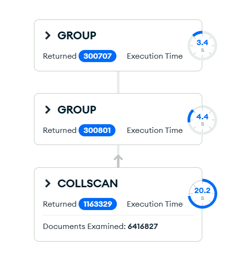

# Upit 3 — Kupci koji kupuju u više zemalja

**Uloga:** Regionalni direktor
 
**Pitanje:** Za transakcije veće od 200, pronaći kupce koji su kupovali u više od jedne zemlje, u kojim zemljama kupuju i koliko troše po zemlji.

## Kod upita

```javascript
db.getSiblingDB("fashion_retail");
db.getCollection("transactions").aggregate(
  [
  { $match: { line_total: { $gt: 200 } } },
  {
    $group: {
      _id: {
        customer_id: "$customer.customer_id",
        country: "$store.country"
      },
      count_transactions: { $sum: 1 },
      total_spent: { $sum: "$line_total" }
    }
  },
  {
    $group: {
      _id: "$_id.customer_id",
      count_country: { $sum: 1 },
      countries: {
        $push: {
          country: "$_id.country",
          transactions: "$count_transactions",
          spent: "$total_spent"
        }
      }
    }
  },
  {
    $match: { count_country: { $gt: 1 } }
  },
  { $sort: { count_country: -1 } }
],
  {
    "allowDiskUse": false
  }
);
```

## Indeks korišćen

```javascript
db.transactions.createIndex({ "line_total": 1 })
```

## Rezultati performansi

| Metrika | Pre indeksa | Posle indeksa                    |
|---|-------------|----------------------------------|
| Execution time (ms) | _36558_     | _25193_                          |
| Documents examined | _6416827_   | _1163329_                        |
| Index keys examined | 0           | _1163329_                        |


## Explain Plan




## Primer izlaznog dokumenta

```json
{
  "_id": 8821,
  "count_country": 2,
  "countries": [
    { "country": "Germany", "transactions": 12, "spent": 2340.50 },
    { "country": "France", "transactions": 3, "spent": 580.20 }
  ]
}
```

