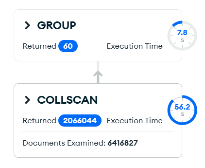

# Upit 4 — Boja sa najvećim prihodom po kvartalu

**Uloga:** Regionalni direktor

**Pitanje:** Za svaku boju odrediti u kom kvartalu se najviše prodaje.

## Kod upita

```javascript
db.getSiblingDB("fashion_retail");
db.getCollection("transactions").aggregate(
  [
  {$match :{color: {$ne:""}}},
  {$group: {
    _id:{
      color: "$color",
      quarter: {$ceil:{$divide:[{$month:"$date"}, 3]}}
    },
    revenue: {$sum: "$line_total"}
  }},
  {$sort: {revenue: -1}},
  {$group:{
    _id:"$_id.color",
    best_revenue: {$first: "$revenue"},
    best_quarter: {$first: "$_id.quarter"}
  }}
],
  {
    "allowDiskUse": false
  }
);
```

## Indeks korišćen

```javascript
db.transactions.createIndex({ "color": 1 })
```

## Rezultati performansi

| Metrika | Pre indeksa | Posle indeksa                    |
|---|-------------|----------------------------------|
| Execution time (ms) | _22564_     | _10836_                          |
| Documents examined | _6416827_   | _2066044_                        |
| Index keys examined | 0           | _2066045_                        |


## Explain Plan




## Primer izlaznog dokumenta

```json
{
  "_id": "BLACK",
  "best_revenue": 59162.97,
  "best_quarter": 2
}
```
