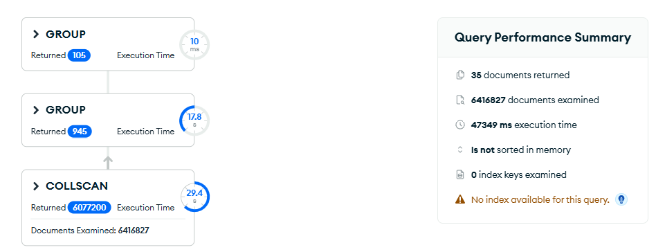
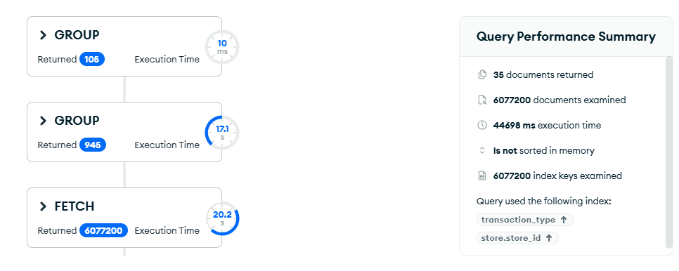
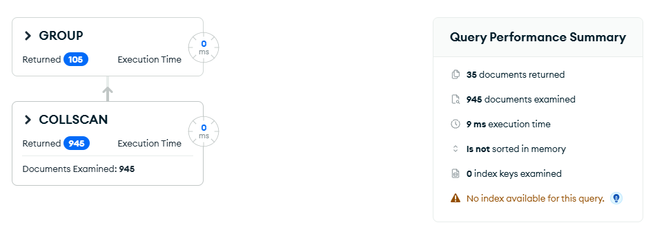

# Upit 1 — Prihod prodavnica po mesecima i godinama

**Uloga:** Regionalni direktor

**Pitanje:** Za svaku prodavnicu odrediti koji meseci u prvoj i drugoj godini imaju najveći i najmanji prihod, i koji je mesečni prosek između godina.

## Kod upita

```javascript
[
  {
    $match: { "transaction_type": "Sale" }
  },
  {
    $group: {
      _id: {
        store_id: "$store.store_id",
        store_name: "$store.store_name",
        year: { $year: "$date" },
        month: { $month: "$date" }
      },
      monthly_revenue: { $sum: "$line_total" }
    }
  },
  {
    $group: {
      _id: {
        store_id: "$_id.store_id",
        store_name: "$_id.store_name",
        year: "$_id.year"
      },
      months: {
        $push: {
          month: "$_id.month",
          revenue: "$monthly_revenue"
        }
      },
      avg_monthly_revenue: { $avg: "$monthly_revenue" },
      max_revenue: { $max: "$monthly_revenue" },
      min_revenue: { $min: "$monthly_revenue" }
    }
  },
  {
    $project: {
      store_id: "$_id.store_id",
      store_name: "$_id.store_name",
      year: "$_id.year",
      avg_monthly_revenue: 1,
      best_month: {
        $arrayElemAt: [
          { $filter: { input: "$months", as: "m", cond: { $eq: ["$$m.revenue", "$max_revenue"] } } },
          0
        ]
      },
      worst_month: {
        $arrayElemAt: [
          { $filter: { input: "$months", as: "m", cond: { $eq: ["$$m.revenue", "$min_revenue"] } } },
          0
        ]
      }
    }
  },
  {
    $group: {
      _id: {
        store_id: "$store_id",
        store_name: "$store_name"
      },
      years: {
        $push: {
          year: "$year",
          best_month: "$best_month.month",
          best_month_revenue: "$best_month.revenue",
          worst_month: "$worst_month.month",
          worst_month_revenue: "$worst_month.revenue",
          avg_monthly_revenue: "$avg_monthly_revenue"
        }
      },
      overall_monthly_avg: { $avg: "$avg_monthly_revenue" }
    }
  },
  {
    $project: {
      _id: 0,
      store_id: "$_id.store_id",
      store_name: "$_id.store_name",
      overall_monthly_avg: 1,
      years: 1
    }
  },
  { $sort: { store_id: 1 } }
]
```

## Indeks korišćen

```javascript
db.transactions.createIndex({ "transaction_type": 1, "store.store_id": 1 })
```

**Zašto se ne očekuje poboljšanje:**

1. **Nema selektivnog `$match`** — `transaction_type: "Sale"` pokriva ~95% dokumenata, pa MongoDB mora da prođe skoro kroz sve dokumente bez obzira na indeks.
2. **`$group` bez filtera** — grupisanje po svim prodavnicama i svim mesecima zahteva pregled cele kolekcije.

**Zaključak:** indeks je testiran ali ne donosi poboljšanje jer upit agregira skoro sve dokumente. Rešenje je restrukturiranje sheme.

## Restrukturiranje sheme

Pošto indeks ne može da pomogne, rešenje je kreiranje **pre-agregirane kolekcije** koja čuva mesečne prihode po prodavnici:

```javascript
db.transactions.aggregate([
  {
    $match: { "transaction_type": "Sale" }
  },
  {
    $group: {
      _id: {
        store_id: "$store.store_id",
        store_name: "$store.store_name",
        year: { $year: "$date" },
        month: { $month: "$date" }
      },
      monthly_revenue: { $sum: "$line_total" }
    }
  },
  { $out: "monthly_revenue_by_store" }
], { allowDiskUse: true })
```

Ovo se pokreće **jednom** i kreira kolekciju `monthly_revenue_by_store` sa samo **~840 dokumenata** (35 prodavnica × 2 godine × 12 meseci). Svi dalji upiti rade na toj maloj kolekciji.

**Upit na restrukturiranoj shemi:**

```javascript
db.getCollection("monthly_revenue_by_store").aggregate([
  {
    $group: {
      _id: {
        store_id: "$_id.store_id",
        store_name: "$_id.store_name",
        year: "$_id.year"
      },
      months: {
        $push: {
          month: "$_id.month",
          revenue: "$monthly_revenue"
        }
      },
      avg_monthly_revenue: { $avg: "$monthly_revenue" },
      max_revenue: { $max: "$monthly_revenue" },
      min_revenue: { $min: "$monthly_revenue" }
    }
  },
  {
    $project: {
      store_id: "$_id.store_id",
      store_name: "$_id.store_name",
      year: "$_id.year",
      avg_monthly_revenue: 1,
      best_month: {
        $arrayElemAt: [
          { $filter: { input: "$months", as: "m", cond: { $eq: ["$$m.revenue", "$max_revenue"] } } },
          0
        ]
      },
      worst_month: {
        $arrayElemAt: [
          { $filter: { input: "$months", as: "m", cond: { $eq: ["$$m.revenue", "$min_revenue"] } } },
          0
        ]
      }
    }
  },
  {
    $group: {
      _id: {
        store_id: "$store_id",
        store_name: "$store_name"
      },
      years: {
        $push: {
          year: "$year",
          best_month: "$best_month.month",
          best_month_revenue: "$best_month.revenue",
          worst_month: "$worst_month.month",
          worst_month_revenue: "$worst_month.revenue",
          avg_monthly_revenue: "$avg_monthly_revenue"
        }
      },
      overall_monthly_avg: { $avg: "$avg_monthly_revenue" }
    }
  },
  {
    $project: {
      _id: 0,
      store_id: "$_id.store_id",
      store_name: "$_id.store_name",
      overall_monthly_avg: 1,
      years: 1
    }
  },
  { $sort: { store_id: 1 } }
])
```

## Rezultati performansi

| Metrika | V1 bez indeksa | V1 sa indeksom | V2 (restrukturirana shema) |
|---|---|---|---|
| Execution time (ms) | 47349 | 44698 | 9 |
| Documents examined | 6416827 | 6077200 | 945 |
| Index keys examined | 0 | 6077200 | 0 |
| Stage | COLLSCAN | IXSCAN → FETCH | COLLSCAN (945 docs) |
| Ubrzanje | — | sporije! | ~5261x |

## Explain Plan

**V1 — bez indeksa:**


**V1 — sa indeksom:**


**V2 — restrukturirana shema:**


## Primer izlaznog dokumenta

```json
{
  "store_id": 7,
  "store_name": "Store Berlin",
  "overall_monthly_avg": 142350.80,
  "years": [
    {
      "year": 2023,
      "best_month": 12,
      "best_month_revenue": 198450.20,
      "worst_month": 2,
      "worst_month_revenue": 89320.50,
      "avg_monthly_revenue": 138200.40
    },
    {
      "year": 2024,
      "best_month": 11,
      "best_month_revenue": 210300.70,
      "worst_month": 1,
      "worst_month_revenue": 95100.30,
      "avg_monthly_revenue": 146501.20
    }
  ]
}
```
