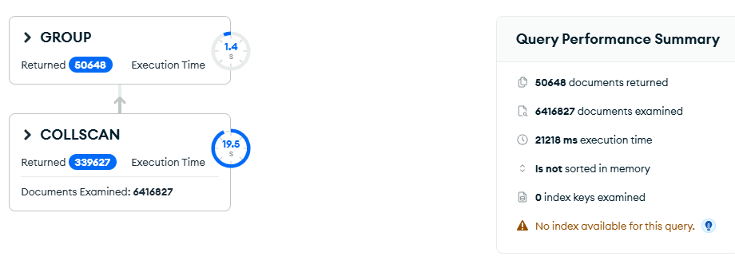
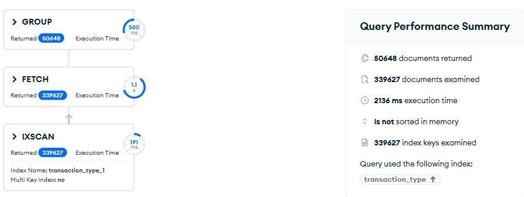
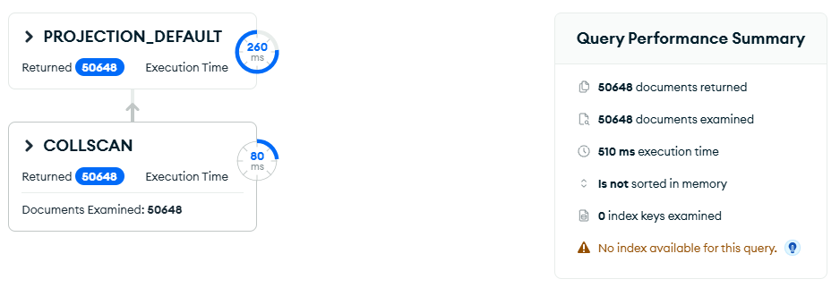

# Upit 2 — Ukupan broj povrata i prosečna cena po SKU

**Uloga:** Menadžer prodaje

**Pitanje:** Za svaki proizvod koji je vraćan, odrediti ukupan broj povrata i prosečnu cenu po kojoj je kupljen.

## Kod upita

```javascript
[
  {
    $match: { "transaction_type": "Return" }
  },
  {
    $group: {
      _id: "$sku",
      total_returns: { $sum: 1 },
      avg_unit_price: { $avg: "$unit_price" }
    }
  },
  {
    $project: {
      _id: 0,
      sku: "$_id",
      total_returns: 1,
      avg_unit_price: { $round: ["$avg_unit_price", 2] }
    }
  },
  { $sort: { total_returns: -1 } }
]
```

## Indeks korišćen

```javascript
db.transactions.createIndex({ "transaction_type": 1 })
```

**Zašto indeks pomaže:**

`transaction_type: "Return"` pokriva samo ~5% dokumenata (339.627 od 6.4M). Indeks je visoko selektivan — MongoDB koristi IXSCAN i čita samo relevantne dokumente umesto cele kolekcije.

**Zaključak:** indeks pomaže (~3.5x ubrzanje), ali restrukturiranje sheme daje dramatično veće poboljšanje.

## Restrukturiranje sheme

Iako indeks pomaže, restrukturiranje omogućava još veće ubrzanje. Kreiranje **pre-agregirane kolekcije** koja čuva statistike po SKU:

```javascript
db.transactions.aggregate([
  { $match: { "transaction_type": "Return" } },
  {
    $group: {
      _id: "$sku",
      total_returns: { $sum: 1 },
      avg_unit_price: { $avg: "$unit_price" }
    }
  },
  { $out: "returns_by_sku" }
], { allowDiskUse: true })
```

Ovo se pokreće **jednom** i kreira kolekciju `returns_by_sku` sa jednim dokumentom po SKU (par hiljada dokumenata umesto 339.627 transakcija). Svi dalji upiti rade na toj maloj kolekciji.

**Upit na restrukturiranoj shemi:**

```javascript
db.getCollection("returns_by_sku").aggregate([
  {
    $project: {
      _id: 0,
      sku: "$_id",
      total_returns: 1,
      avg_unit_price: { $round: ["$avg_unit_price", 2] }
    }
  },
  { $sort: { total_returns: -1 } }
])
```

## Rezultati performansi

| Metrika | V1 bez indeksa | V1 sa indeksom | V2 (restrukturirana shema) |
|---|---|---|---|
| Execution time (ms) | 21218 | 2136 | 510 |
| Documents examined | 6416827 | 339627 | 50648 |
| Index keys examined | 0 | 339627 | 0 |
| Stage | COLLSCAN | IXSCAN → FETCH | COLLSCAN (50648 docs) |
| Ubrzanje | — | ~10x | ~42x |

## Explain Plan

**V1 — bez indeksa:**


**V1 — sa indeksom:**


**V2 — restrukturirana shema:**


## Primer izlaznog dokumenta

```json
{
  "sku": "FESH441-M-BLACK",
  "total_returns": 45,
  "avg_unit_price": 198.50
}
```
