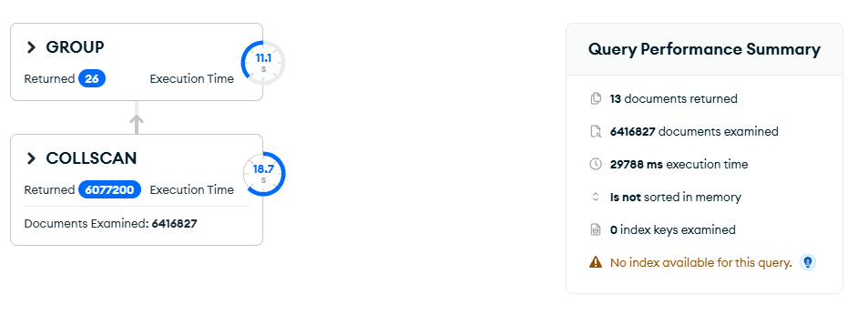
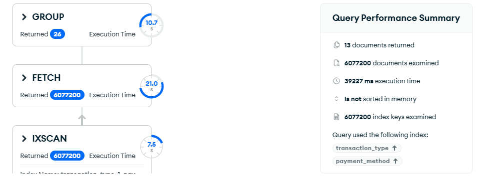
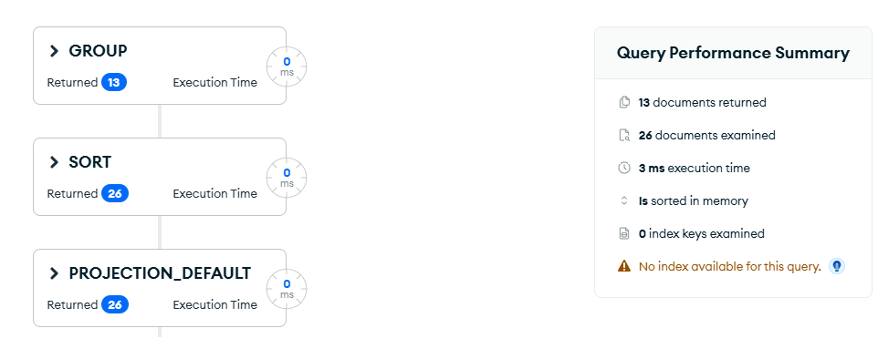

# Upit 3 — Dominantni payment method po satu u danu

**Uloga:** Menadžer prodaje

**Pitanje:** Za svaki sat u danu odrediti koji payment method dominira i koliki prihod generiše.

## Kod upita

```javascript
[
  {
    $match: { "transaction_type": "Sale" }
  },
  {
    $group: {
      _id: {
        hour: { $hour: "$date" },
        payment_method: "$payment_method"
      },
      total_revenue: { $sum: "$line_total" },
      transaction_count: { $sum: 1 }
    }
  },
  {
    $sort: { total_revenue: -1 }
  },
  {
    $group: {
      _id: "$_id.hour",
      dominant_payment_method: { $first: "$_id.payment_method" },
      total_revenue: { $first: "$total_revenue" },
      transaction_count: { $first: "$transaction_count" }
    }
  },
  {
    $project: {
      _id: 0,
      hour: "$_id",
      dominant_payment_method: 1,
      total_revenue: { $round: ["$total_revenue", 2] },
      transaction_count: 1
    }
  },
  { $sort: { hour: 1 } }
]
```

## Indeks korišćen

```javascript
db.transactions.createIndex({ "transaction_type": 1, "payment_method": 1 })
```

**Zašto se ne očekuje poboljšanje:**

1. **Nema selektivnog `$match`** — `transaction_type: "Sale"` pokriva ~95% dokumenata, pa MongoDB mora da prođe skoro kroz sve dokumente bez obzira na indeks.
2. **FETCH overhead** — indeks pronađe 6M ključeva pa mora da učita 6M dokumenata, što je sporije od direktnog COLLSCAN-a.

**Zaključak:** indeks je testiran ali ne donosi poboljšanje — štaviše usporava upit. Rešenje je restrukturiranje sheme.

## Restrukturiranje sheme

Pošto indeks ne može da pomogne, rešenje je kreiranje **pre-agregirane kolekcije** koja čuva statistike po satu i payment metodu:

```javascript
db.transactions.aggregate([
  { $match: { "transaction_type": "Sale" } },
  {
    $group: {
      _id: {
        hour: { $hour: "$date" },
        payment_method: "$payment_method"
      },
      total_revenue: { $sum: "$line_total" },
      transaction_count: { $sum: 1 }
    }
  },
  { $out: "hourly_payment_stats" }
], { allowDiskUse: true })
```

Ovo se pokreće **jednom** i kreira kolekciju `hourly_payment_stats` sa samo **~100 dokumenata** (24 sata × ~4-5 payment metoda). Svi dalji upiti rade na toj maloj kolekciji.

**Upit na restrukturiranoj shemi:**

```javascript
db.getCollection("hourly_payment_stats").aggregate([
  { $sort: { total_revenue: -1 } },
  {
    $group: {
      _id: "$_id.hour",
      dominant_payment_method: { $first: "$_id.payment_method" },
      total_revenue: { $first: "$total_revenue" },
      transaction_count: { $first: "$transaction_count" }
    }
  },
  {
    $project: {
      _id: 0,
      hour: "$_id",
      dominant_payment_method: 1,
      total_revenue: { $round: ["$total_revenue", 2] },
      transaction_count: 1
    }
  },
  { $sort: { hour: 1 } }
])
```

## Rezultati performansi

| Metrika | V1 bez indeksa | V1 sa indeksom | V2 (restrukturirana shema) |
|---|---|---|---|
| Execution time (ms) | 29788 | 39227 | 3 |
| Documents examined | 6416827 | 6077200 | 26 |
| Index keys examined | 0 | 6077200 | 0 |
| Stage | COLLSCAN | IXSCAN → FETCH | COLLSCAN (26 docs) |
| Ubrzanje | — | sporije! | ~9929x |

## Explain Plan

**V1 — bez indeksa:**


**V1 — sa indeksom:**


**V2 — restrukturirana shema:**


## Primer izlaznog dokumenta

```json
{
  "hour": 14,
  "dominant_payment_method": "Credit Card",
  "total_revenue": 1250430.50,
  "transaction_count": 8320
}
```
