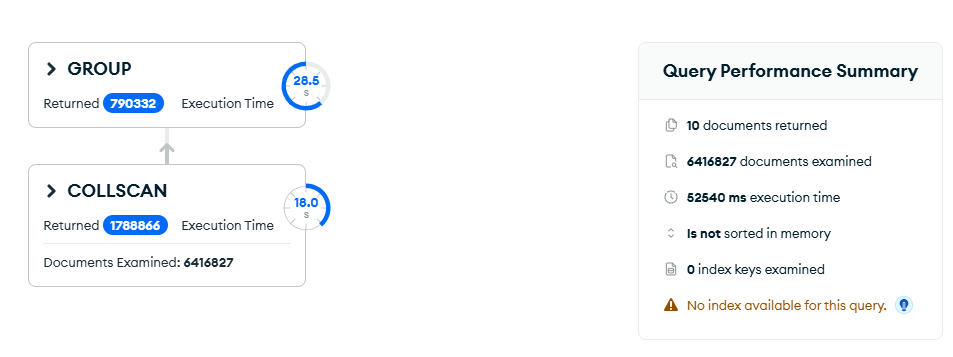
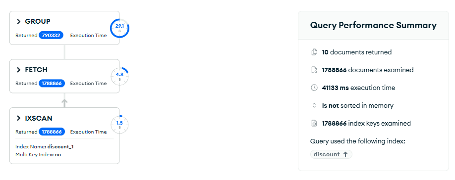
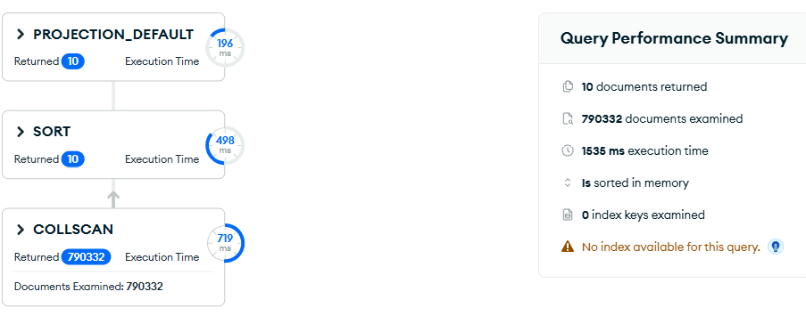
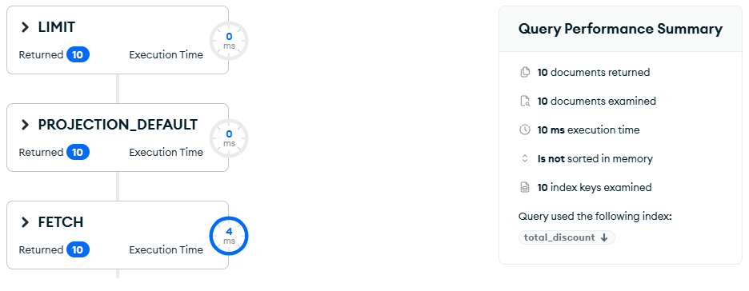

# Upit 4 — Top 10 kupaca po ukupnom popustu

**Uloga:** Menadžer prodaje

**Pitanje:** Top 10 kupaca po ukupnom popustu (unit_price × quantity × discount) — ko je najviše iskoristio popuste.

## Kod upita

```javascript
[
  {
    $match: { "discount": { $gt: 0 } }
  },
  {
    $group: {
      _id: {
        customer_id: "$customer.customer_id",
        name: "$customer.name"
      },
      total_discount: {
        $sum: {
          $multiply: ["$unit_price", "$quantity", "$discount"]
        }
      },
      transaction_count: { $sum: 1 }
    }
  },
  {
    $project: {
      _id: 0,
      customer_id: "$_id.customer_id",
      name: "$_id.name",
      total_discount: { $round: ["$total_discount", 2] },
      transaction_count: 1
    }
  },
  { $sort: { total_discount: -1 } },
  { $limit: 10 }
]
```

## Indeks korišćen

```javascript
db.transactions.createIndex({ "discount": 1 })
```

**Zašto indeks delimično pomaže:**

`discount > 0` pokriva ~28% dokumenata (1.788.866 od 6.4M). Ovo je granični slučaj — indeks smanjuje broj pregledanih dokumenata sa 6.4M na 1.79M, ali FETCH overhead znači da ubrzanje nije dramatično. Rezultat: 52540ms → 41133ms (~1.28x ubrzanje).

## Restrukturiranje sheme

Pošto indeks donosi samo delimično poboljšanje, rešenje je kreiranje **pre-agregirane kolekcije** koja čuva ukupan popust po kupcu:

```javascript
db.transactions.aggregate([
  { $match: { "discount": { $gt: 0 } } },
  {
    $group: {
      _id: {
        customer_id: "$customer.customer_id",
        name: "$customer.name"
      },
      total_discount: {
        $sum: { $multiply: ["$unit_price", "$quantity", "$discount"] }
      },
      transaction_count: { $sum: 1 }
    }
  },
  { $out: "customer_discount_totals" }
], { allowDiskUse: true })
```

Ovo se pokreće **jednom** i kreira kolekciju `customer_discount_totals` sa jednim dokumentom po kupcu (par hiljada dokumenata umesto 1.79M transakcija). Svi dalji upiti rade na toj maloj kolekciji.

**Upit na restrukturiranoj shemi:**

```javascript
db.getCollection("customer_discount_totals").aggregate([
  { $sort: { total_discount: -1 } },
  { $limit: 10 },
  {
    $project: {
      _id: 0,
      customer_id: "$_id.customer_id",
      name: "$_id.name",
      total_discount: { $round: ["$total_discount", 2] },
      transaction_count: 1
    }
  }
])
```

## Rezultati performansi

| Metrika | V1 (originalna shema) | V1 + indeks | V2 (restrukturirana shema) | V2 + indeks |
|---|---|---|---|---|
| Execution time (ms) | 52540 | 41133 | 1535 | 10 |
| Documents examined | 6416827 | 1788866 | 790332 | 10 |
| Index keys examined | 0 | 1788866 | 0 | 10 |
| Stage | COLLSCAN | IXSCAN → FETCH | COLLSCAN → SORT | FETCH → LIMIT |
| Ubrzanje | — | ~1.28x | ~34x | ~5254x |

## Explain Plan

**V1 — bez indeksa:**


**V1 — sa indeksom:**


**V2 — restrukturirana shema:**


**V2 + indeks:**


## Primer izlaznog dokumenta

```json
{
  "customer_id": 45231,
  "name": "Maria Schmidt",
  "total_discount": 8432.50,
  "transaction_count": 127
}
```
