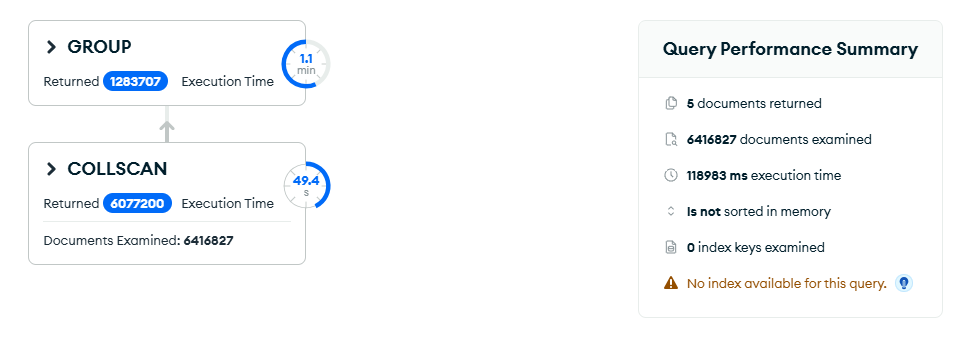
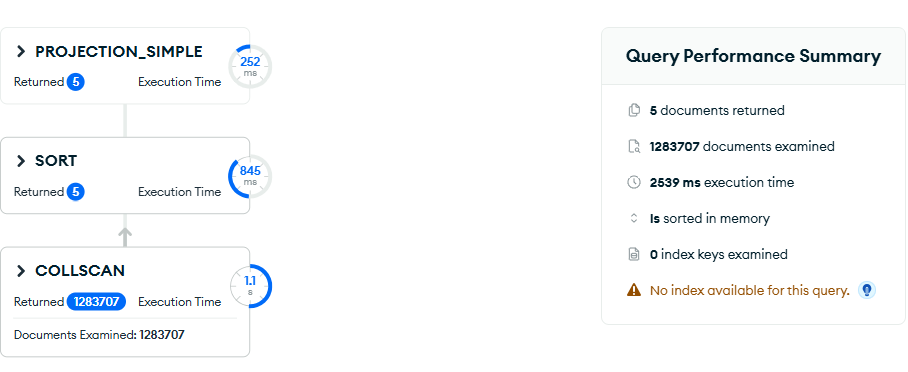
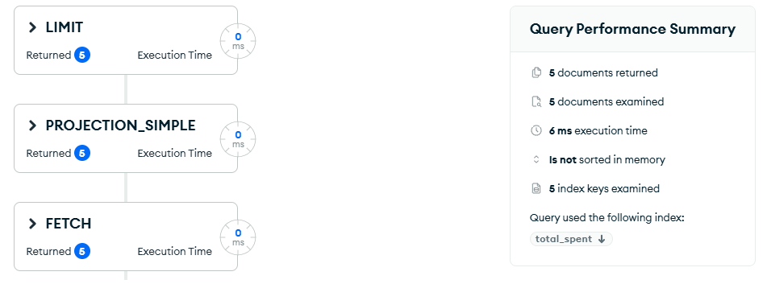

# Upit 5 — Top 5 kupaca po ukupnoj potrošnji

**Uloga:** Menadžer prodaje

**Pitanje:** Koji 5 kupaca ima najveću ukupnu potrošnju, koliki je njihov prosečan iznos transakcije i koliko kupovina su obavili?

## Kod upita

```javascript
[
  {
    $match: { "line_total": { $gt: 0 } }
  },
  {
    $group: {
      _id: "$customer.customer_id",
      name: { $first: "$customer.name" },
      total_spent: { $sum: "$line_total" },
      avg_transaction: { $avg: "$line_total" },
      transaction_count: { $sum: 1 }
    }
  },
  { $sort: { total_spent: -1 } },
  { $limit: 5 },
  {
    $project: {
      _id: 0,
      customer_id: "$_id",
      name: 1,
      total_spent: { $round: ["$total_spent", 2] },
      avg_transaction: { $round: ["$avg_transaction", 2] },
      transaction_count: 1
    }
  }
]
```

## Indeks korišćen

```javascript
db.transactions.createIndex({ "customer.customer_id": 1 })
```

**Zašto se ne očekuje poboljšanje:**

1. **Nema selektivnog `$match`** — `line_total > 0` pokriva skoro sve dokumente (praktično cela kolekcija).
2. **`$group` bez filtera** — grupisanje po svim kupcima zahteva pregled cele kolekcije od 6.4M dokumenata.
3. **Indeks ne pomaže `$group`** — MongoDB mora da pročita svaki dokument da bi sumirao `line_total`.

**Zaključak:** indeks je testiran ali ne donosi poboljšanje jer upit mora da agregiše skoro sve dokumente. Rešenje je restrukturiranje sheme.

## Restrukturiranje sheme

Pošto indeks ne može da pomogne, rešenje je kreiranje **pre-agregirane kolekcije** koja čuva statistike po kupcu:

```javascript
db.transactions.aggregate([
  { $match: { "line_total": { $gt: 0 } } },
  {
    $group: {
      _id: "$customer.customer_id",
      name: { $first: "$customer.name" },
      total_spent: { $sum: "$line_total" },
      avg_transaction: { $avg: "$line_total" },
      transaction_count: { $sum: 1 }
    }
  },
  { $out: "customer_totals" }
], { allowDiskUse: true })
```

Ovo se pokreće **jednom** i kreira kolekciju `customer_totals` sa jednim dokumentom po kupcu (~1.283.707 dokumenata umesto 6.4M transakcija). Svi dalji upiti rade na toj manjoj kolekciji.

**Upit na restrukturiranoj shemi:**

```javascript
db.getCollection("customer_totals").aggregate([
  { $sort: { total_spent: -1 } },
  { $limit: 5 },
  {
    $project: {
      _id: 0,
      customer_id: "$_id",
      name: 1,
      total_spent: { $round: ["$total_spent", 2] },
      avg_transaction: { $round: ["$avg_transaction", 2] },
      transaction_count: 1
    }
  }
])
```

## Indeks na restrukturiranoj shemi

Pošto V2 kolekcija `customer_totals` ima 1.283.707 dokumenata, `$sort` troši 845ms. Indeks na `total_spent` eliminiše sortiranje:

```javascript
db.customer_totals.createIndex({ total_spent: -1 })
```

## Rezultati performansi

| Metrika | V1 (originalna shema) | V2 (restrukturirana shema) | V2 + indeks |
|---|---|---|---|
| Execution time (ms) | 118983 | 2539 | 6 |
| Documents examined | 6416827 | 1283707 | 5 |
| Index keys examined | 0 | 0 | 5 |
| Stage | COLLSCAN → GROUP | COLLSCAN → SORT | FETCH → LIMIT |
| Ubrzanje | — | ~47x | ~19830x |

## Explain Plan

**V1 — originalna shema:**


**V2 — restrukturirana shema:**


**V2 + indeks:**


## Primer izlaznog dokumenta

```json
{
  "customer_id": 45231,
  "name": "Maria Schmidt",
  "total_spent": 28430.50,
  "avg_transaction": 223.86,
  "transaction_count": 127
}
```
